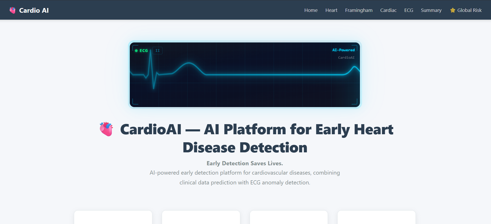
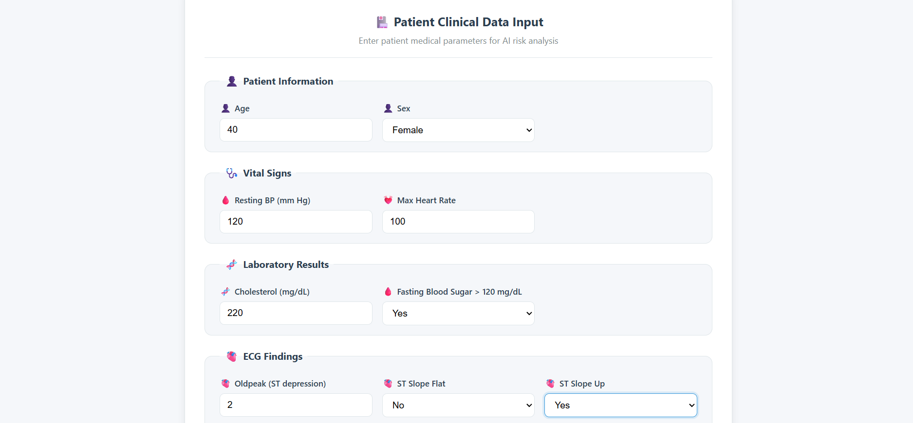
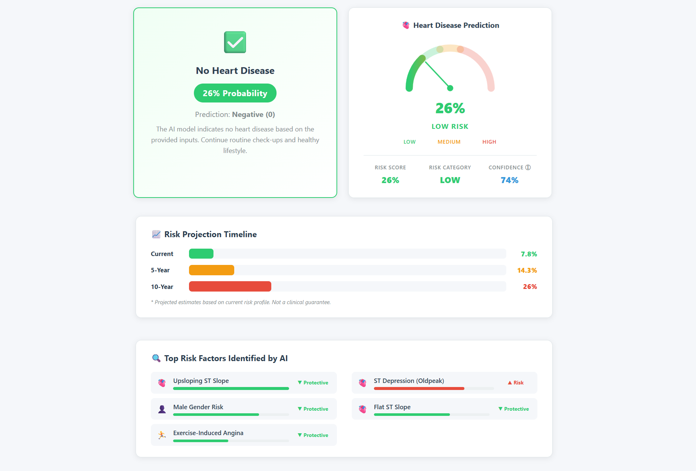
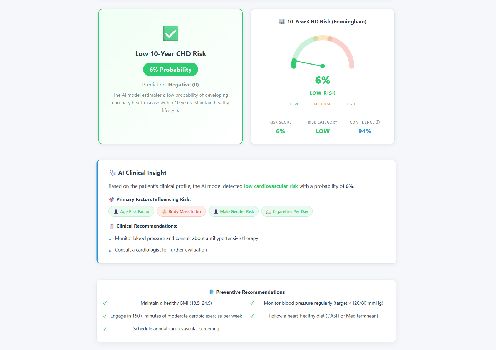
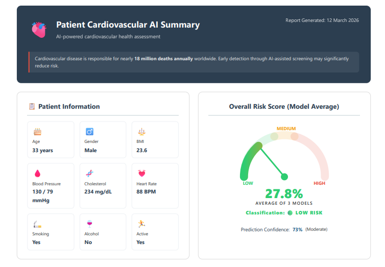
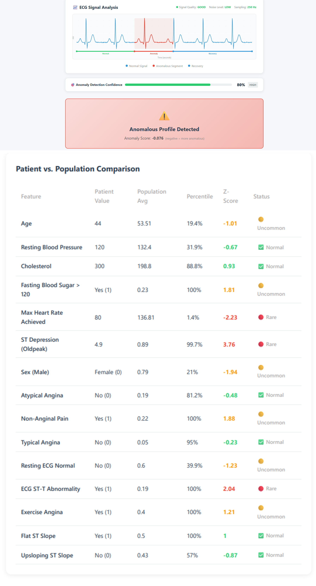

<div align="center">

# 🫀 AI Cardiovascular Risk Platform

**Multi-model AI system for early cardiovascular disease risk detection**

[](https://python.org)
[](https://fastapi.tiangolo.com)
[](https://react.dev)
[](LICENSE)

> ⚠️ **Medical Disclaimer:** This system is for **educational and research purposes only** and should **not replace professional medical advice**. Always consult a qualified healthcare professional for clinical decisions.

</div>

---

## 📌 Overview

The **AI Cardiovascular Risk Platform** is a full-stack clinical decision support tool that uses **four trained machine learning models** to predict cardiovascular risk from patient data. It delivers explainable predictions using **SHAP**, visualises risk on interactive dashboards, and generates downloadable patient reports.

Cardiovascular disease causes **~18 million deaths annually** worldwide. Early detection through AI-assisted screening can significantly reduce mortality.

---

## 🏗️ Architecture

```
👤 User
  │
  ▼
┌─────────────────────────────┐
│   React Frontend (Vite)     │  http://localhost:5173
│   Prediction Forms · Charts │
│   ECG Monitor · Reports     │
└──────────────┬──────────────┘
               │  HTTP (Vite proxy → /api/*)
               ▼
┌─────────────────────────────┐
│     FastAPI Backend         │  http://localhost:8000
│   Preprocessing · SHAP      │
│   Medical Rule Engine       │
└──┬──────┬──────┬─────┬──────┘
   │      │      │     │
   ▼      ▼      ▼     ▼
┌──────┐ ┌──────┐ ┌──────┐ ┌──────────┐
│Heart │ │Fram. │ │Cardi.│ │   ECG    │
│ RF   │ │  RF  │ │  GB  │ │Isolation │
│Model │ │Model │ │Model │ │ Forest   │
└──┬───┘ └──┬───┘ └──┬───┘ └────┬─────┘
   └────────┴────────┴──────────┘
                  │  SHAP Explanations
                  ▼
        ┌──────────────────┐
        │ ⭐ Global Risk    │
        │    Engine        │
        │ 0.4×Heart +      │
        │ 0.3×Framingham + │
        │ 0.2×Cardiac +    │
        │ 0.1×ECG          │
        └────────┬─────────┘
                 │
                 ▼
        📄 Risk Report + Recommendations
```

> See full diagram: [`docs/architecture.png`](docs/architecture.png)

---

## ✨ Features

| Feature | Description |
|---------|-------------|
| 🫀 Heart Disease Prediction | Random Forest trained on UCI Cleveland dataset (920 patients) |
| 📊 Framingham 10-Year CHD Risk | Logistic/RF model trained on Framingham Heart Study (3,660 patients) |
| 💔 Cardiac Failure Prediction | Gradient Boosting trained on 70K cardiovascular patient records |
| 📈 ECG Anomaly Detection | Isolation Forest for unsupervised ECG signal anomaly detection |
| ⭐ Global Risk Score | Ensemble average across all 4 models |
| 🔍 SHAP Explainability | Feature contribution bars for every prediction |
| 📄 Patient Health Report | Downloadable full AI health summary report |
| 🩺 Clinical Recommendations | Personalised AI-generated recommendations per patient |

---

## 🤖 Models & Performance

| Model | Algorithm | Dataset | Accuracy | AUC-ROC |
|-------|-----------|---------|----------|---------|
| Heart Disease | Random Forest | UCI Cleveland (920 rows) | **86%** | **0.91** |
| Framingham CHD | Random Forest | Framingham (3,660 rows) | **82%** | **0.83** |
| Cardiac Failure | Gradient Boosting | CVD dataset (70K rows) | **74%** | **0.79** |
| ECG Anomaly | Isolation Forest | PTB ECG Database | ~unsupervised | — |

> **Note:** Medical ML models are evaluated with **AUC-ROC** and **recall** (sensitivity) rather than raw accuracy, as cardiovascular datasets are typically imbalanced — missing a high-risk patient is far more costly than a false positive.

---

## 🏥 Clinical Validation

10 representative clinical scenarios were used to validate model output consistency:

| # | Clinical Scenario | Heart | Framingham | Cardiac | Global Risk |
|---|-------------------|-------|------------|---------|-------------|
| 1 | Healthy young adult (25F, no risk factors) | LOW | LOW | LOW | 🟢 LOW |
| 2 | Elderly hypertensive smoker (68M, BP 160/100) | HIGH | HIGH | HIGH | 🔴 HIGH |
| 3 | Metabolic syndrome (50M, obese, diabetic) | HIGH | MODERATE | HIGH | 🔴 HIGH |
| 4 | Fit athlete (35M, BP 110/70, low cholesterol) | LOW | LOW | LOW | 🟢 LOW |
| 5 | Diabetic patient (55F, glucose 140, BP 135/85) | MODERATE | MODERATE | MODERATE | 🟡 MODERATE |
| 6 | Post-stroke patient (72M, on BP meds) | HIGH | HIGH | HIGH | 🔴 HIGH |
| 7 | High cholesterol only (45F, chol 280) | MODERATE | LOW | LOW | 🟢 LOW |
| 8 | Heavy smoker (48M, 20 cigs/day) | MODERATE | MODERATE | LOW | 🟡 MODERATE |
| 9 | Well-managed hypertensive (60M, on meds) | MODERATE | LOW | MODERATE | 🟡 MODERATE |
| 10 | Young smoker with family history (30M) | LOW | LOW | LOW | 🟢 LOW |

---

## 📸 Screenshots

| Homepage & Features | Clinical Data Input |
| :---: | :---: |
|  |  |

| Heart Disease Prediction | Framingham 10-Yr Risk |
| :---: | :---: |
|  |  |

<div align="center">
  <b>Patient Cardiovascular AI Summary & Overall Risk Score</b><br>
  
</div>

<br>

<div align="center">
  <b>ECG Anomaly Detection & AI Patient Summary</b><br>
  
</div>

---

## 📁 Project Structure

```
cardio-ai-platform/
├── backend/                 # FastAPI application
│   ├── main.py              # App entry point & CORS setup
│   ├── model_loader.py      # Loads .pkl model files
│   ├── predictor.py         # Prediction logic + risk labelling
│   ├── ecg_analysis.py      # ECG anomaly detection
│   ├── routers/             # Modular route handlers
│   │   ├── heart_routes.py
│   │   ├── framingham_routes.py
│   │   └── cardiac_routes.py
│   └── utils/               # Preprocessing & SHAP explainer
│       ├── preprocessing.py
│       └── shap_explainer.py
├── frontend/                # React + Vite UI
│   └── src/
│       ├── pages/           # RiskPrediction, PatientSummary, ECGMonitor
│       ├── components/      # RiskCard, PatientForm, Charts
│       └── api/             # API service layer (api.js)
├── training/                # Model training scripts
├── notebooks/               # EDA & experiments
├── models/                  # Saved .pkl model files (Git LFS)
├── data/                    # Raw & processed datasets
├── docs/                    # Architecture diagram & dataset docs
│   ├── architecture.png
│   └── dataset_description.md
├── .env.example             # Environment variable template
├── requirements.txt         # Python dependencies
└── LICENSE                  # MIT License
```

---

## 🚀 Installation & Setup

### Prerequisites

- Python 3.10+
- Node.js 18+
- Git with Git LFS (for model files)

### 1. Clone the Repository

```bash
git clone https://github.com/CHETHANCHARMANNAPK/AI-cardiovascular-risk-platform.git
cd AI-cardiovascular-risk-platform
git lfs pull   # download model .pkl files
```

### 2. Backend Setup

```bash
# Create and activate virtual environment
python -m venv .venv
.venv\Scripts\activate      # Windows
source .venv/bin/activate   # macOS/Linux

# Install dependencies
pip install -r requirements.txt

# (Optional) Copy environment variables
cp .env.example .env

# Start the backend
uvicorn backend.main:app --reload
```

Backend runs at: **http://localhost:8000**

### 3. Frontend Setup

```bash
cd frontend
npm install
npm run dev
```

Frontend runs at: **http://localhost:5173**

> The Vite dev server automatically proxies `/api/*` requests to the FastAPI backend.

---

## 📡 API Reference

### Heart Disease Prediction

```
POST /predict-heart
```

**Request:**
```json
{
  "Age": 52,
  "RestingBP": 130,
  "Cholesterol": 240,
  "FastingBS": 1,
  "MaxHR": 140,
  "Oldpeak": 2.0,
  "Sex_M": 1,
  "ChestPainType_ATA": 0,
  "ChestPainType_NAP": 0,
  "ChestPainType_TA": 0,
  "RestingECG_Normal": 1,
  "RestingECG_ST": 0,
  "ExerciseAngina_Y": 0,
  "ST_Slope_Flat": 0,
  "ST_Slope_Up": 1
}
```

**Response:**
```json
{
  "model": "heart",
  "prediction": 1,
  "probability": 44.0,
  "confidence": 56.0,
  "risk_label": "MODERATE",
  "explanation": { "...clinical summary..." },
  "shap_explanation": {
    "base_value": 0.38,
    "contributions": {
      "Oldpeak": 0.112,
      "ST_Slope_Up": -0.087
    }
  }
}
```

### Other Endpoints

| Method | Endpoint | Description |
|--------|----------|-------------|
| `GET` | `/` | Health check |
| `POST` | `/predict-heart` | Heart disease prediction |
| `POST` | `/predict-risk` | Framingham 10-year CHD risk |
| `POST` | `/predict-cardiac` | Cardiac failure prediction |
| `POST` | `/analyze-ecg` | ECG anomaly detection |

---

## ⚙️ Global Risk Engine

The overall cardiovascular risk score is a **weighted ensemble** of all 4 models:

```
Global Risk = (Heart × 0.4) + (Framingham × 0.3) + (Cardiac × 0.2) + (ECG × 0.1)
```

| Weight | Model | Rationale |
|--------|-------|-----------|
| 40% | Heart Disease | Direct cardiac condition detection |
| 30% | Framingham | Validated 10-year clinical risk score |
| 20% | Cardiac Failure | Structural heart failure detection |
| 10% | ECG Anomaly | Signal-based early warning |

---

## 🗃️ Datasets

| Dataset | Source | Size | Target |
|---------|--------|------|--------|
| Heart Disease | UCI Cleveland | 920 rows | Binary: disease / no disease |
| Framingham CHD | Framingham Heart Study | 3,660 rows | Binary: 10-yr CHD risk |
| Cardiovascular Disease | Kaggle CVD | 70,000 rows | Binary: cardiac failure |
| ECG Signals | PTB Diagnostic ECG DB | Signal data | Anomaly detection |

See [`docs/dataset_description.md`](docs/dataset_description.md) for full details.

---

## 🔮 Future Work

- [ ] Real-time wearable device integration (Apple Watch / Fitbit)
- [ ] Hospital EHR (Electronic Health Record) integration via FHIR API
- [ ] Longitudinal risk tracking — monitor patient risk over time
- [ ] Multi-language support for global healthcare deployment
- [ ] Mobile app (React Native) for point-of-care use
- [ ] Federated learning for privacy-preserving model updates

---

## 📜 License

This project is licensed under the **MIT License** — see [LICENSE](LICENSE) for details.

---

<div align="center">

**Built for healthcare AI research and education**

⭐ Star this repo if you found it helpful!

</div>
